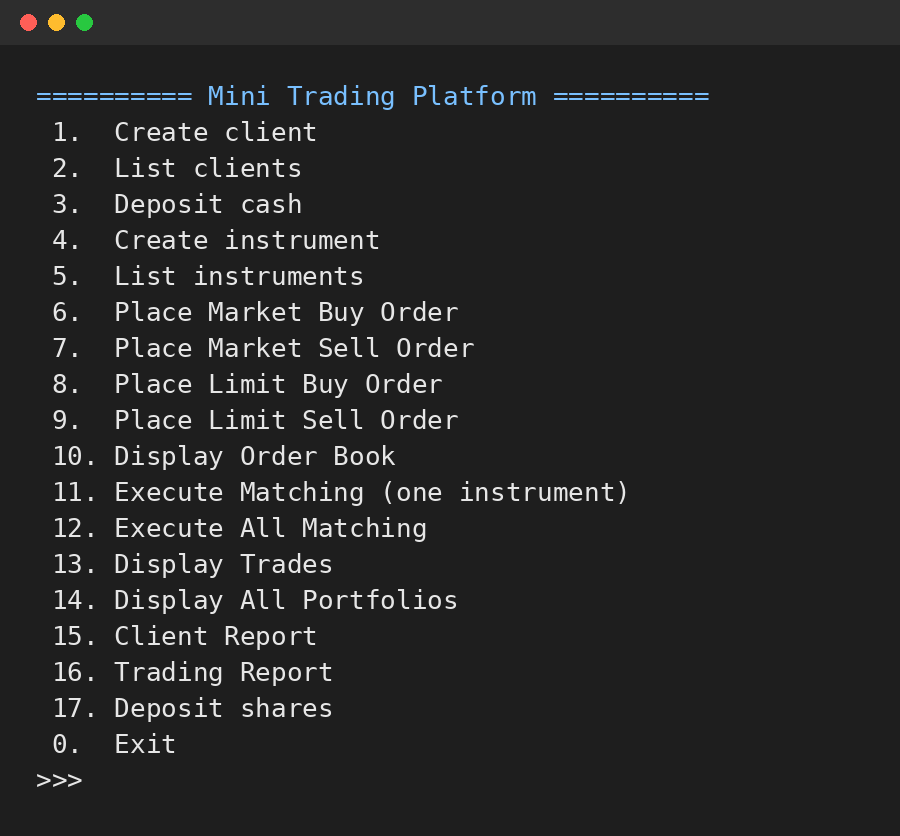
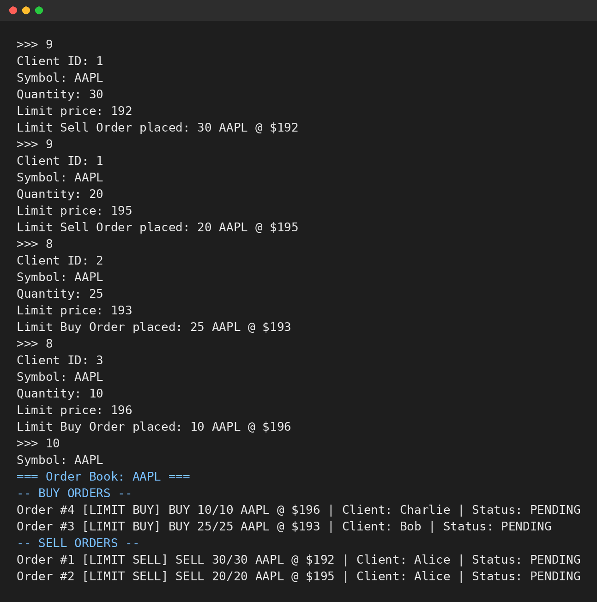
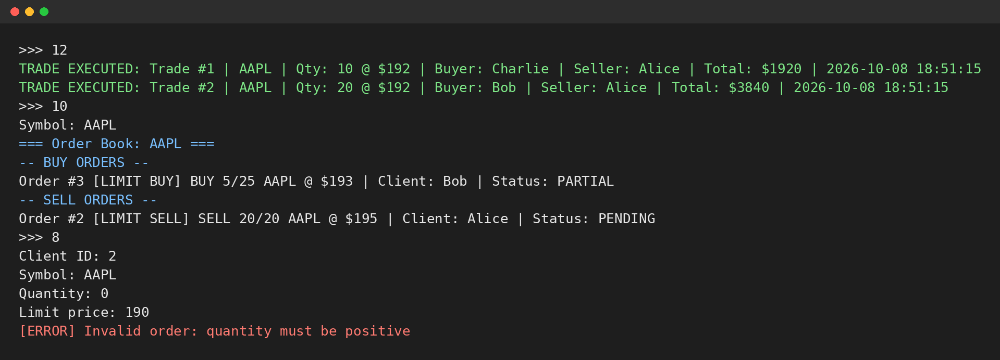
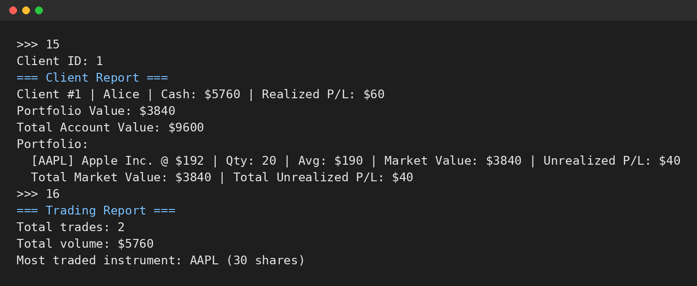

# Mini Trading Platform

A command-line trading platform written in C++17. Clients place market and limit orders on financial instruments, orders are stored in one order book per instrument, and a matching engine executes trades between buyers and sellers.



## Features

- Client accounts with cash balance, portfolio and realized profit and loss
- Instruments (for example AAPL) with a market price updated to the last traded price
- Four order types: market buy, market sell, limit buy, limit sell
- One order book per instrument, with buy orders sorted by highest price and sell orders by lowest price
- Matching engine with price-time priority and partial fills
- Portfolio valuation with average acquisition price and unrealized profit and loss
- Client report and global trading report (number of trades, traded volume, most traded instrument)
- Order validation with custom exceptions (insufficient funds, insufficient shares, invalid order, unknown client or instrument)

## How matching works

1. A new order is added to the order book of its instrument. Buy orders are sorted from the highest to the lowest price, sell orders from the lowest to the highest. Orders at the same price keep their arrival order.
2. When matching is executed, the engine compares the best buy order with the best sell order.
3. If the buy price is greater than or equal to the sell price, a trade is executed at the sell price for the smaller of the two remaining quantities.
4. Cash and positions of both clients are updated, the seller's realized profit and loss is recorded, and the instrument's market price is set to the trade price.
5. Fully filled orders leave the book, partially filled orders stay with their remaining quantity. The loop stops when the best prices no longer cross.

## Example

Alice holds 50 AAPL shares and places two sell orders. Bob and Charlie place buy orders:



Matching executes Charlie's order first (best price), then fills 20 of Bob's 25 shares. The remaining 5 stay in the book with the status PARTIAL. Invalid orders are rejected:



Alice sold 30 shares bought at $190 for $192, for a realized profit of $60:



## Design

The project is built around object-oriented principles: inheritance, polymorphism, encapsulation, operator overloading and custom exceptions.

```
Order (abstract: getPrice, getType)
├── MarketOrder        price = current market price of the instrument
│   ├── MarketBuyOrder
│   └── MarketSellOrder
└── LimitOrder         price = limit price set by the client
    ├── LimitBuyOrder
    └── LimitSellOrder
```

Other classes:

- `TradingPlatform`: entry point, holds clients, instruments, order books and trade history, and runs the menu
- `OrderBook`: buy and sell orders of one instrument, and the matching algorithm
- `Client`, `Portfolio`, `Position`: cash, holdings, average price and profit and loss
- `Instrument`, `Trade`: traded asset and executed transaction
- `Exceptions.h`: custom exception classes derived from `std::runtime_error`

## Build and run

Requirements: a C++17 compiler and CMake 3.10 or later.

```bash
git clone https://github.com/LorenzoLeMoineau/MiniTradingPlatform.git
cd MiniTradingPlatform
cmake -S . -B build
cmake --build build
./build/trading
```

A typical session: create clients (1), deposit cash (3), create an instrument (4), give shares to a seller (17), place orders (6 to 9), display the order book (10) and execute matching (11 or 12).

## Context

Individual course project at EFREI Paris (2026).

## Possible improvements

- Order cancellation and modification
- Prevention of self-trading (a client matching against their own order)
- Unit tests for the matching engine
- Smart pointers instead of raw pointers for memory management
